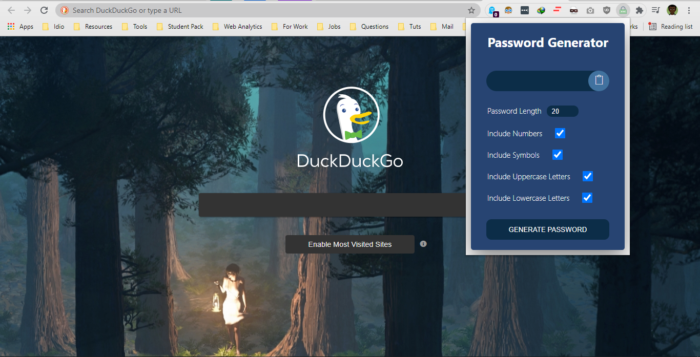

<h1 align="center">Welcome to Cryptolla 👋</h1>
<p>
  
  <a href="https://github.com/bolorundurovj/pass-gen-ext" target="_blank">
    
  </a>
  <a href="/licence" target="_blank">
    
  </a>
  <a href="https://twitter.com/bolorundurovb" target="_blank">
    
  </a>
</p>

> A chrome extension for generating passwords to match specific requirements

### 🏠 [Homepage](/home)

### ✨ [Demo](https://github.com/bolorundurovj/pass-gen-ext)



## Usage

```sh
 Go to the extensions tab in your browser, select `load unpacked` and upload the project folder.
```


## Author

👤 **Bolorunduro Valiant-Joshua**

* Website: bolorundurovb.live
* Twitter: [@bolorundurovb](https://twitter.com/bolorundurovb)
* Github: [@bolorundurovj](https://github.com/bolorundurovj)
* LinkedIn: [@bolorundurovb](https://linkedin.com/in/bolorundurovb)

## 🤝 Contributing

Contributions, issues and feature requests are welcome!<br />Feel free to check [issues page](https://github.com/bolorundurovj/pass-gen-ext/issues). You can also take a look at the [contributing guide](https://github.com/bolorundurovj/pass-gen-ext/issues).

## Show your support

Give a ⭐️ if this project helped you!

<a href="https://www.patreon.com/bolorundurovb">
  
</a>

## 📝 License

Copyright © 2021 [Bolorunduro Valiant-Joshua](https://github.com/bolorundurovj).<br />
This project is [MIT](/licence) licensed.

***
_This README was generated with ❤️ by [readme-md-generator](https://github.com/kefranabg/readme-md-generator)_